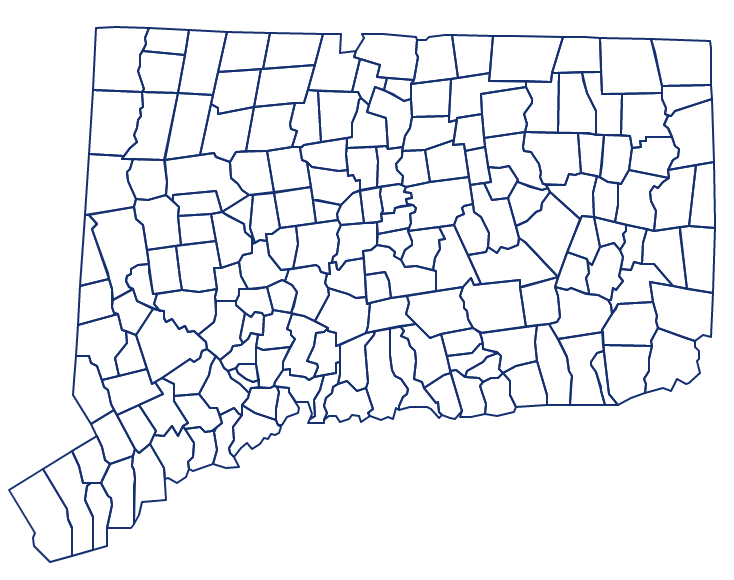
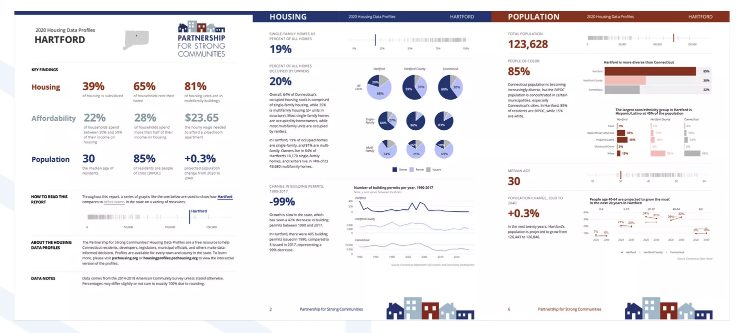
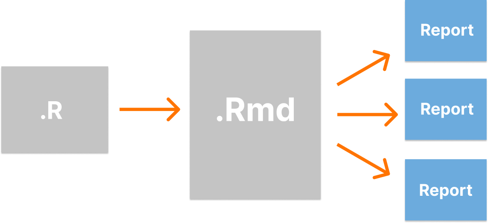
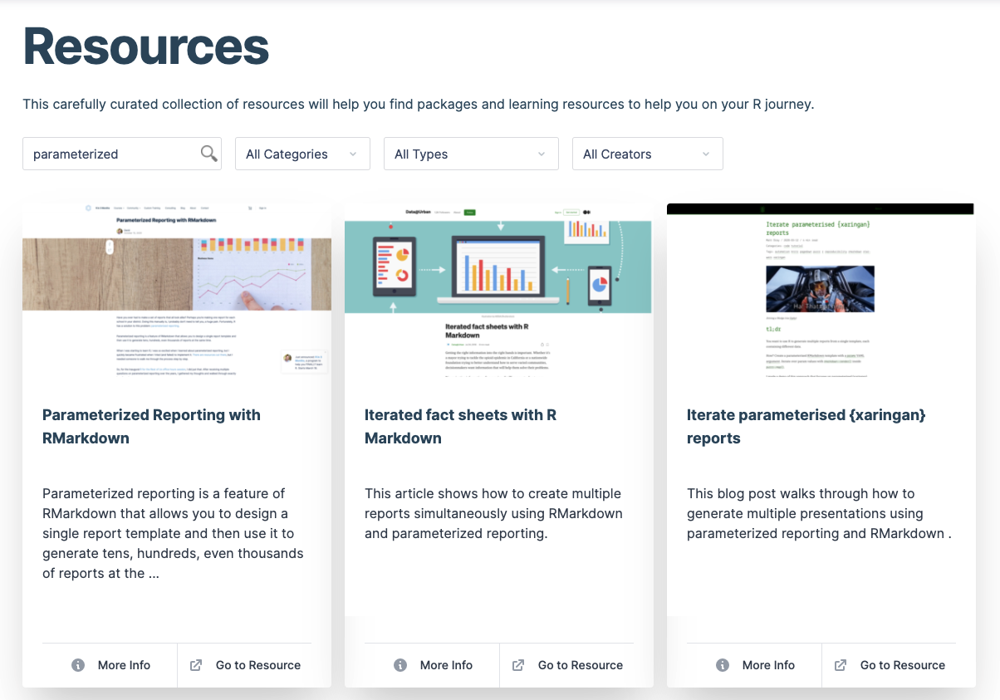

```{r setup, include=FALSE}
knitr::opts_chunk$set(eval = FALSE, 
                      warning = FALSE,
                      message = FALSE,
                      rows.print = 5)
```

layout: true
  
<div class="dk-footer">
<span>
<a href="https://rfortherestofus.com/" target="_blank">R for the Rest of Us
</a>
</span>
</div> 

---

class: center, middle, inverse

# How do you make 170 reports? 

---

class: center, middle



???

Tell story of CTData

---

class: center, middle

[](https://housingprofiles.pschousing.org/)

---

# Parameterized Reporting

--



---


[](https://rfortherestofus.com/resources/?_search=parameterized)

